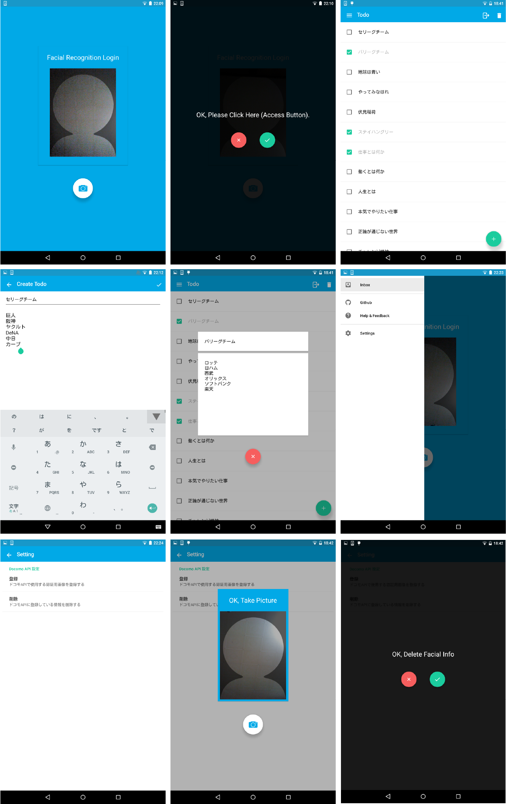

# AuthTodoSample
顔認証付きTodoアプリ（ゼミ6月）

#### 機能
* 顔認証APIに接続し、ログイン処理を行う
* メモアプリ機能

#### 開発環境
* Mac OS X 10.10.3
* Android Studio 1.1.0
* Nexus 7 (Android 5.1)
* SDKやビルド環境についてはGradleファイル参照

#### スクリーンショット


#### 追加
次の`<string name="api_key">XXXXXXXXX</string>`の所にdocomo Developerで取得したAPIキーを入力して、`/app/src/main/res/values/strings.xml`に保存する。APIキー取得にはdocomo Developerへの登録（無料ユーザ）が必要

```xml
<resources>
    <string name="app_name">Todo</string>

    <string name="todo">Todo</string>
    <string name="title">Title</string>
    <string name="body">Body</string>
    <string name="todo_create">Create Todo</string>
    <string name="todo_update">Update Todo</string>
    <string name="setting">Setting</string>
    <string name="todo_empty">You\'re all done!</string>

    <string name="drawer_open">Menu opened</string>
    <string name="drawer_close">Menu closed</string>
    <string name="drawer_item_inbox">Inbox</string>
    <string name="drawer_item_settings">Settings</string>
    <string name="drawer_item_github">Github</string>
    <string name="drawer_item_help">Help &amp; Feedback</string>
    <string name="drawer_item_attributions">Attributions</string>

    <string name="logout">Logout</string>
    <string name="delete">Delete</string>
    <string name="done">Done</string>

    <!-- Preference file -->
    <string name="setting_auth_title">Docomo API 設定</string>
    <string name="setting_key_face_id_num">face_id</string>
    <string name="setting_title_face_id_num">登録</string>
    <string name="setting_summary_face_id_num">ドコモAPIで使用する認証用画像を登録する</string>
    <string name="setting_key_delete_info">delete_info</string>
    <string name="setting_title_delete_info">削除</string>
    <string name="setting_summary_delete_info">ドコモAPIに登録している情報を削除する</string>

    <string name="setting_key_login_status">is_login</string>

    <!-- docomo API information -->
    <string name="key_register">register</string>
    <string name="key_verify">verify</string>
    <string name="key_tag_edit">tag_edit</string>
    <string name="key_list">list</string>
    <string name="key_delete">delete</string>
    <string name="api_key">XXXXXXXXX</string>
</resources>
```

#### APIリファレンス
* [顔認証API][facial_verify_reference_link]

#### APIガイドライン（必読）
* [画像認識API関連ガイドライン][facial_verify_guideline_link]


[facial_verify_reference_link]: https://dev.smt.docomo.ne.jp/?p=common_page&p_name=pux_faceauthentication
[facial_verify_guideline_link]: https://dev.smt.docomo.ne.jp/?p=docs.api.page&api_name=image_recognition&p_name=guideline#tag01